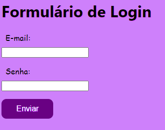

# índice
 
* [Form-login](#form-login)
* [Descrição](#descrição)
* [Introdução](#introdução)
* [Funcionalidades](#funcionalidades)
* [Tecnologias Utilidades](#tecnologias-utilizadas)
* [Fontes Consultadas](#fontes-consultadas)
* [Autores](#autores)
 
# Formulário de Login
 
## Descrição 📖
- Este projeto consiste em um formulário de login que solicita ao usuário seu e-mail e senha para autenticação. O formulário foi desenvolvido utilizando HTML e CSS, e possui validação de campos para garantir a correta entrada de dados. Após o preenchimento correto dos campos, o usuário pode realizar o login no sistema.
 
## Introdução ✉️
- Preenchimento de dados em um formulário de contatos  

 
## Funcionalidades 🧠
- Aprender a construir um formulario de login em HTML5
 
## Tecnologias Utilizadas 🖥️
- Visual Studio Code
- CSS3
- HTML5
- Github
- Boot Strap
- Git

## Fontes Consultadas 🔗
- [boot strap](https://getbootstrap.com/)
 
## Autores 👥
- [naillim novaski](https://github.com/naillimnovaski)
- [Nicolas Tonassi](https://github.com/nicolas-tonassi)
- [Murilo Tonassi](https://github.com/murilo-tonassi)
